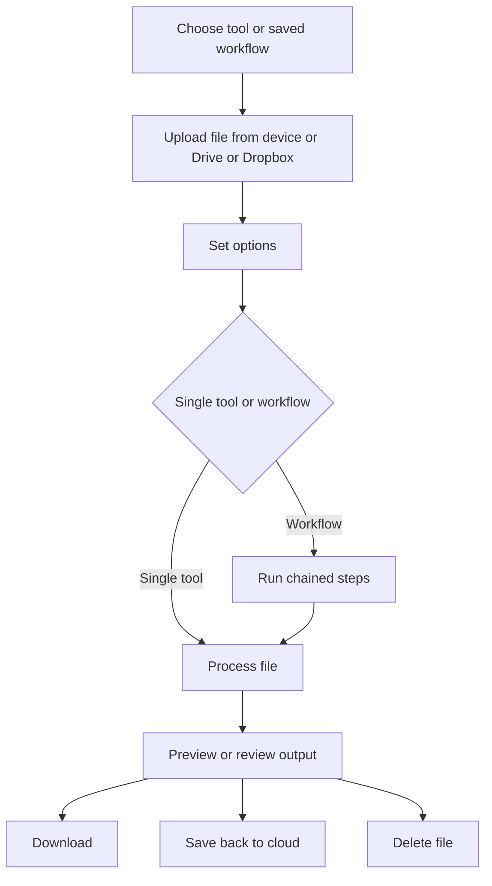

# iLovePDF Analytical Report

## Executive summary

iLovePDF has grown from a browser-based PDF utility into a broader document platform that now spans web tools, mobile apps, a desktop app, e-signing, workflow automation, regional file processing, team features, and a developer/API ecosystem. The current official catalogue on `ilovepdf.com` includes 25 core PDF tools plus newer “PDF Intelligence” features such as AI summarisation, PDF translation, and PDF-to-Markdown conversion. The company markets the service very aggressively as simple and free, but its own pricing matrix makes the commercial reality clearer: the free Basic tier gives access to “essential” tools with limited processing, while Premium unlocks all tools, unlimited processing, web/mobile/desktop access, digital signatures, workflows, regional processing, preferential support, and 2,000 AI credits; Business adds custom contracts, a dedicated account manager, and SSO for 25+ users. citeturn14view0turn40view0turn41view0

From a product-analysis perspective, iLovePDF’s strongest differentiators are breadth, ease of use, and ecosystem fit. The platform covers most mainstream PDF jobs end to end, supports Google Drive and Dropbox on the consumer side, exposes automation through iLoveAPI and no-code connectors such as Zapier, Make, Microsoft Power Automate, WordPress, and n8n, and offers an offline desktop workflow for privacy-sensitive or heavy local processing. For teams, the most meaningful additions are workflows, regional file processing, team administration, and business packaging. For developers, the API adds JWT authentication, official SDKs/libraries, webhooks, URL uploads, encryption options, rate/error handling, and credit-based consumption. citeturn14view0turn25view0turn25view1turn23view2turn39view2turn20view0

On privacy and security, iLovePDF’s official pages are stronger than many consumer PDF sites in the clarity of their claims. The company states that files are encrypted in transit and at rest, that files are automatically deleted within two hours, that it is ISO/IEC 27001 certified and GDPR compliant, and that it does not sell user data to third parties. Its security page also references eIDAS-qualified trust service providers for signatures. However, some details remain unspecified or only partially documented on the main iLovePDF pages reviewed here: explicit CCPA positioning for the core iLovePDF product is not clearly stated, no SOC attestation is highlighted on the pages reviewed, and some plan boundaries are easier to infer from the pricing matrix than from the homepage marketing. citeturn11view7turn11view4turn14view0turn40view0

Commercially, Premium is straightforward at $5 per month when billed annually or $9 billed monthly, while Business is custom-quoted. Billing auto-renews unless cancelled, and direct subscriptions have a consumer withdrawal window of 14 calendar days in some circumstances, but that right can expire earlier once the service is used/downloaded/installed beyond reasonable verification. Payments after a free-trial period are non-refundable, except for a malfunction-based refund path described in the terms. Education is a real, not cosmetic, programme: students and academic professionals can receive a full year of Premium free, while institutions are routed into an education licence conversation. citeturn40view0turn13view0turn13view1turn12view2turn12view0turn26search0turn26search3

Independent user sentiment is positive overall. G2’s seller profile showed iLovePDF at 4.6/5 from 582 verified reviews, and user commentary on G2 and Capterra consistently praises speed, simplicity, and breadth of routine PDF tooling. The most common complaints in third-party reviews are exactly what the official pricing structure predicts: free-tier limits, occasional upload-processing ambiguity, and advanced features being gated behind paid plans. citeturn29search4turn29search1turn29search5turn29search13

## Research scope and source quality

This report prioritises official iLovePDF sources: the homepage, features page, pricing page, help/FAQ, terms and privacy/security pages, desktop and mobile app pages, business pages, blog posts on workflows and regional file processing, and the related iLoveAPI product’s overview, pricing, documentation, and integrations pages. Competitor references are based primarily on official Smallpdf, PDF24, and Adobe Acrobat pages. Third-party review sources were used only as supplementary evidence for user sentiment, not as the primary basis for product facts. citeturn15search3turn14view0turn40view0turn9view2turn9view1turn20view0turn20view1turn16view0turn16view2turn16view1turn23view0turn23view1turn23view2turn25view0turn32search5turn36view0turn31search6

A few places required careful interpretation because the official pages do not always explain themselves consistently. The most important example is the contrast between the homepage claim that the tools are “100% FREE” and the pricing page, which more precisely states that Basic is free but limited, while Premium and Business unlock material features and/or remove quotas. A second example is the developer side: iLoveAPI pricing advertises 2,500 free credits per month upon registration, while the API reference separately says a free developer account comes with a 250-file monthly processing limit. Those two statements may be reconcilable depending on tool credit costs, but the site does not reconcile them on a single page, so the gap should be treated as an official-documentation ambiguity rather than silently harmonised. citeturn15search3turn40view0turn23view1turn23view2

A third ambiguity is the desktop offer. The main pricing matrix marks Desktop access as unavailable on Basic and available on Premium/Business, but the separate desktop page also advertises a free “Desktop Reader” and a paid “Desktop Tools and Reader” subscription. The most defensible reading is that there is a genuinely free reader, while the full desktop toolset is the paid component. Because the pages do not spell that distinction out in the same place, this report treats it as an official positioning nuance, not a contradiction to be “fixed” by assumption. citeturn41view0turn20view0

## Services and feature catalogue

The official tool list currently spans the following categories: organise PDF, optimise PDF, convert to PDF, convert from PDF, edit PDF, PDF security, and PDF Intelligence. Across those categories, iLovePDF lists Merge PDF, Split PDF, Remove pages, Extract pages, Organize PDF, Scan to PDF, Compress PDF, Repair PDF, OCR PDF, JPG to PDF, Word to PDF, PowerPoint to PDF, Excel to PDF, HTML to PDF, PDF to JPG, PDF to Word, PDF to PowerPoint, PDF to Excel, PDF to PDF/A, Rotate PDF, Add page numbers, Add watermark, Crop PDF, Edit PDF, PDF Forms, Unlock PDF, Protect PDF, Sign PDF, Redact PDF, Compare PDF, AI Summarizer, Translate PDF, and PDF to Markdown. Adjacent products linked from the same ecosystem include iLoveIMG, iLoveSign, and iLoveAPI. citeturn14view0turn14view1turn40view0

The consumer-facing breadth is more substantial than a superficial homepage scan suggests. Unlike many simple PDF tools, iLovePDF now includes fillable forms, crop, redact, compare, AI summarisation, full-PDF translation, and Markdown extraction. The desktop app adds offline bulk work, a free reader, right-click conversions, password protection, and PDF/A validation. The mobile app adds scanning, annotation, signing, and a file manager. The business layer adds workflows, team administration, AI/OCR positioning, and business integrations. The developer layer adds PDF, image, and signature APIs. In short, iLovePDF is no longer just “merge/split/compress”; it is closer to a mid-market PDF workflow stack with a consumer entry point. citeturn20view0turn20view1turn16view0turn23view0turn25view3

The table below compiles the official service catalogue and the most important observable behaviour/positioning from iLovePDF’s own pages. “Unspecified” means the reviewed official pages did not clearly state the point. citeturn14view0turn17search0turn17search2turn17search3turn17search4turn18search0turn18search1turn19search0turn19search1turn16view3

| Category | Tool or service | What the tool officially does | Important observable options or notes |
|---|---|---|---|
| Organise | Merge PDF | Combine PDFs in chosen order | Drag-and-drop ordering; upload from computer, Drive, Dropbox. citeturn28search5 |
| Organise | Split PDF | Separate one page or a set into independent PDFs | Smart Split exists separately in pricing matrix and uses AI credits; standard split remains core tool. citeturn14view0turn40view0 |
| Organise | Remove pages | Delete specific PDF pages | Available in tool catalogue and pricing matrix. citeturn14view0turn40view0 |
| Organise | Extract pages | Pull selected pages out into a new file | Available in tool catalogue. citeturn14view0 |
| Organise | Organize PDF | Reorder, rotate, manage PDF pages | Marketed as “freedom to manage your files”; desktop also supports heavy bulk use. citeturn14view0turn20view0 |
| Organise | Scan to PDF | Create PDFs from scans/images | Web tool listed; mobile app also pushes scan-first usage. citeturn14view0turn20view1 |
| Optimise | Compress PDF | Reduce PDF file size | Web UI exposes Extreme, Recommended, and Less compression modes. citeturn28search3 |
| Optimise | Repair PDF | Attempt to repair broken/corrupt PDFs | Present in catalogue and pricing matrix; detailed internal method unspecified. citeturn14view0turn40view0 |
| Optimise | OCR PDF | Turn non-selectable/scanned PDFs into searchable/selectable PDFs | Accuracy improves when document language(s) are selected correctly. citeturn17search0 |
| Convert to PDF | JPG to PDF | Convert JPG images to PDF | Orientation, page size, margin controls, optional merge into one PDF. Web page explicitly says JPG; broader image-type support on web is otherwise unspecified on this page. citeturn28search9 |
| Convert to PDF | Word to PDF | Convert DOC/DOCX to PDF | Upload from computer/Drive/Dropbox. citeturn27search0 |
| Convert to PDF | PowerPoint to PDF | Convert PPT/PPTX to PDF | Present in tool catalogue and pricing matrix. citeturn14view0turn40view0 |
| Convert to PDF | Excel to PDF | Convert spreadsheets to PDF | Upload from computer/Drive/Dropbox. citeturn27search2 |
| Convert to PDF | HTML to PDF | Convert webpage/HTML content to PDF | Listed as web tool and developer/API function. citeturn14view0turn25view2 |
| Convert from PDF | PDF to JPG | Convert PDF pages to images and/or extract images | Present in tool page; PDF OCR/Office workflows can prompt OCR for scan-heavy files. citeturn19search14turn28search11 |
| Convert from PDF | PDF to Word | Convert PDF to editable Word | Official page says “almost 100% accurate”; OCR path available for scanned pages on paid tiers. citeturn28search13turn40view0 |
| Convert from PDF | PDF to PowerPoint | Convert PDF to editable slides | Present in catalogue and pricing matrix. citeturn14view0turn40view0 |
| Convert from PDF | PDF to Excel | Extract PDF tables to Excel | OCR path available for scanned pages on paid tiers. citeturn28search11turn40view0 |
| Convert from PDF | PDF to PDF/A | Convert to archival PDF/A | Not available on Basic in pricing matrix. citeturn40view0 |
| Edit | Rotate PDF | Rotate one or more pages | Present across web, desktop, mobile contexts. citeturn14view0turn20view0turn21view0 |
| Edit | Add page numbers | Insert page numbering | Tool exists on all main plans; desktop/mobile/app support also referenced. citeturn14view0turn40view0turn21view0 |
| Edit | Add watermark | Apply text or logo watermark | Tool exists on main plans; Android listing mentions position, transparency, typography. citeturn14view0turn40view0turn21view0 |
| Edit | Crop PDF | Trim page margins or keep selected region | Current page vs all pages selection in UI. citeturn18search0 |
| Edit | Edit PDF | Add/edit text and content in PDFs | Official pages market direct editing; exact edit-depth for every object type is unspecified. citeturn17search6turn16view0 |
| Edit | PDF Forms | Fill forms or create fillable PDFs | Supports text fields, checkboxes, radio buttons, list boxes, combo boxes; AI field detection on flattened/scanned forms was announced in official blog and does not consume AI credits under Premium. citeturn17search2turn19search16turn17search13 |
| Security | Unlock PDF | Remove password from PDFs you are authorised to use | Available across plans. citeturn14view0turn40view0 |
| Security | Protect PDF | Apply password to PDF | Desktop page explicitly positions it for local sensitive-document protection. citeturn14view0turn20view0 |
| Security | Sign PDF | Sign yourself or request signatures from others | UI offers Simple Signature and Digital Signature; Digital Signature is explicitly marked Premium in the tool UI. citeturn16view3 |
| Security | Redact PDF | Permanently remove visible text/graphics | Presets for credit card, phone, email; search text; page redaction; right-to-left languages not currently supported. citeturn17search3turn17search7 |
| Security | Compare PDF | Display differences between two versions | Modes: Semantic Text and Content Overlay; scroll sync; downloadable change report. citeturn17search4turn17search8 |
| PDF Intelligence | AI Summarizer | Summarise PDF reports, essays, study guides with AI | Standard AI is plan-gated; advanced AI consumes AI credits. Older official blog also described settings for summary length/AI level. citeturn19search1turn19search3turn19search5turn40view0 |
| PDF Intelligence | Translate PDF | Translate whole PDFs while preserving layout as closely as possible | Tool page says AI-based translation preserves formatting; official blog says OCR is built in for scanned PDFs. citeturn18search1turn18search9turn40view0 |
| PDF Intelligence | PDF to Markdown | Convert PDF into structured `.md` | Official page emphasises preservation of headings, tables, lists, and links; useful for LLM or knowledge-base ingestion. citeturn19search0 |
| Workflow layer | Workflows | Chain multiple tools into one automated sequence | Official blog says up to four iLovePDF tools can be combined in one workflow. citeturn16view2 |
| Adjacent products | iLoveIMG, iLoveSign, iLoveAPI | Image editing, dedicated e-signing, developer automation | Linked throughout the main iLovePDF navigation. citeturn14view0turn40view0 |

### Free and paid access

The homepage’s “all are 100% free” message should be read as a marketing simplification, not as a literal statement that every capability is unlimited at zero cost. The pricing page is the authoritative source for access boundaries. Basic is free and includes access to essential tools plus limited processing. Premium expands that to full access to all iLovePDF tools, unlimited processing, web/mobile/desktop access, digital signatures, workflows, ad-free use, priority support, regional file processing, and 2,000 AI credits. Business includes all Premium features and adds custom contracts, a dedicated account manager, and SSO. citeturn15search3turn40view0

The most important plan gates are not the old-style “tool completely absent vs present” distinction; they are the finer details. Smart Split, advanced AI functions, workflows, desktop access, digital signatures, teams, regional processing, AI credits, and support level are where Premium/Business create most of the differentiation. In addition, some output-quality workflows involving OCR are only exposed as paid variants in the conversion matrix, even though the standalone OCR PDF tool itself is listed for Basic. citeturn40view0turn41view0

The official pricing matrix is unusually detailed and exposes both document-count quotas and file-size ceilings per tool family. That matters because iLovePDF’s practical usability depends far more on those ceilings than on whether a tool name appears in the menu. A casual free user can access many tools, but larger merges, conversions, AI jobs, and multi-file work are where Premium meaningfully changes capacity. citeturn41view0

The table below condenses the commercially important differences. citeturn40view0turn41view0

| Area | Basic | Premium | Business |
|---|---|---|---|
| Price | Free | $5/month billed annually or $9 billed monthly | Custom quote |
| User band | 1 | 1–25 | 25+ |
| Tool access | “Limited tools” / essential access | All tools included | All tools included |
| Processing | Limited | Unlimited | Unlimited |
| AI credits | None | 2,000 | Custom |
| Workflows | No | Yes | Yes |
| Digital signatures | Not listed as Premium feature; tool UI shows Digital Signature as Premium | Yes | Yes |
| Teams | No | Yes | Yes |
| Desktop tools | No in main pricing matrix | Yes | Yes |
| Regional file processing | No | Yes | Yes |
| Support | Basic | Preferential | Dedicated |
| SSO | No | No | Yes |

### Limits, quotas, file sizes, and file-type support

iLovePDF publishes a per-tool quota matrix that is one of the more useful parts of the site because it reveals the real operating envelope. Selected document-count caps per task include: Merge PDF at 25 documents on Basic and 500 on Premium/Business; Compress PDF at 2 on Basic and 10 on Premium/Business; Image to PDF at 20 on Basic and 80 on Premium/Business; Organize PDF pages at 5 on Basic and 20 on Premium/Business; Sign PDF at 3 on Basic and 5 on Premium/Business; Compare PDF always at 2; and many edit/review/AI tools at 1 document per task across all plans. Batch processing itself is marked “Limited” on Basic and “Unlimited” on Premium/Business. citeturn41view0

Selected file-size ceilings per task are equally material. Merge and Split jump from 100 MB on Basic to 4 GB on Premium/Business. Office-to-PDF, PDF-to-Office, OCR PDF, and the classic PDF-to-editable-Office exports jump from 15 MB to 4 GB. Image to PDF grows from 40 MB to 4 GB. Redact and Compare are 400 MB even on Basic, but do not scale upward in the matrix. Edit PDF and Sign PDF remain capped at 100 MB and 50 MB respectively even on paid tiers in the published matrix. Translate PDF and PDF to Markdown move from 15 MB on Basic to 200 MB on Premium/Business, while AI Summarizer stays at 50 MB. citeturn41view0

AI functions have an additional quota layer. Premium includes 2,000 AI credits. In the main pricing matrix, Smart Split is unavailable on Basic and listed at 200 pages on Premium, while advanced tiers for AI Summarizer and Translate PDF are unavailable on Basic and shown as 67 pages on Premium, with Business marked “Custom.” The site does not fully explain the AI-credit arithmetic on the consumer pricing page itself, so those page counts are the most reliable public user-facing numbers for the main iLovePDF product. citeturn40view0turn41view0

On file-type support, iLovePDF is clear on the mainstream formats: web conversion pages explicitly mention DOC/DOCX for Word to PDF, Excel spreadsheets for Excel to PDF, and common Microsoft Office families throughout desktop/mobile messaging. The web JPG-to-PDF page explicitly names JPG and exposes page-layout controls. The desktop app explicitly says it can process Microsoft Office files and JPG or PNG images, while the Android app broadens this further by describing phone scanning, PDF/image OCR, Office conversion, and image extraction. Where exact subtype lists are not published on the reviewed page, this report marks broader support as unspecified rather than inferred. citeturn27search0turn27search2turn28search9turn20view0turn21view0

A small but noteworthy point on watermarking: iLovePDF clearly offers an “Add watermark” feature as a user tool, but the reviewed official pages did not state that free outputs are branded or stamped by iLovePDF itself. In other words, user-controlled watermarking is documented; service-imposed watermarking on free exports is unspecified on the pages reviewed. citeturn14view0turn40view0

## User experience and typical workflows

The core web UX is consistent across most tools. iLovePDF’s own pages repeat the same interaction model: choose a tool, upload from local storage or by drag-and-drop, optionally pull files from Google Drive or Dropbox, adjust tool-specific parameters, run the job, then download/save the result. This consistency is one reason the service reviews well for ease of use, and it explains why even a very broad tool catalogue still feels like one product rather than a collection of unrelated widgets. citeturn14view0turn16view3turn28search5turn28search3turn17search0turn18search0

Specific UI flows are also reasonably transparent from the official tool pages. Merge PDF lets the user reorder uploads visually and then merge. Compress PDF exposes named modes such as Extreme, Recommended, and Less compression. OCR PDF asks the user to pick the document language(s) to improve recognition. Crop PDF uses a visible drag-to-keep selection area plus “all pages/current page” application. Compare PDF offers “Semantic Text” and “Content Overlay” modes with optional scroll sync. Redact PDF provides presets for email/phone/card detection plus manual or page-level redaction. PDF Forms combines fill, create, and field-addition behaviours. Sign PDF starts by asking whether only the uploader signs or whether several people need to sign, then exposes required and optional fields. citeturn28search5turn28search3turn17search0turn18search0turn17search4turn17search3turn17search2turn16view3

Workflows are now a distinctive part of the experience for recurring tasks. iLovePDF’s March 2026 official blog explains that logged-in users can create a workflow by going to Workflows, clicking “Add a workflow,” naming it, choosing tools to connect, and saving it. The same post says one workflow can chain up to four iLovePDF tools, so a typical sequence might be organise pages → merge → compress → convert. That is strategically important because it shifts iLovePDF from one-off file conversion toward repeatable document operations. citeturn16view2

Regional file processing is another newer UX/business control. The official March 2026 blog says the setting is configured from profile settings, where the user selects a country or region and confirms it. iLovePDF frames this as both a compliance and performance feature: it can support data-residency discussions and may reduce latency for geographically distant users. The blog explicitly notes that Split PDF’s Smart Split is always processed in Europe, which is a rare example of the company documenting a region-specific exception. citeturn16view1

The typical end-to-end user journey can be summarised as follows. citeturn14view0turn16view2turn16view1

## Plans, pricing, billing, refunds, and support

The current self-serve pricing published on the main iLovePDF site is simple. Basic is free. Premium is $5 per month when billed annually, shown as $60 billed annually, or $9 billed monthly. Business is not self-serve priced; it is routed to sales for custom pricing and is positioned for 25+ users. Premium self-serve is positioned for 1–25 users, which also implies small-team usage before the sales-led Business handoff. citeturn40view0

Premium’s published value proposition is substantial relative to the free tier: full access to all tools, unlimited processing, cross-platform access across web/mobile/desktop, digital signatures, workflows, ad-free experience, preferential support, regional file processing, and 2,000 AI credits. Business adds all Premium features plus custom contracts, a dedicated account manager, and SSO. The business page further layers in role/permission management, dedicated support/servers, API automation, and business-sector positioning for HR, legal, finance, real estate, sales, and healthcare. citeturn40view0turn39view3turn39view2turn39view0

Billing terms are stricter than the marketing pages might lead a casual buyer to expect. The terms state that subscriptions generally renew automatically in monthly or annual periods unless cancelled at least seven calendar days before expiry. For direct payments, iLovePDF lists Stripe, Play Store, App Store, Huawei AppGallery, Microsoft Store, bank transfer and sometimes SEPA for Business users, plus PagBrasil for certain Brazilian payment methods. Consumable product packages on the company’s broader service stack are stated to expire after five years if unused. citeturn13view0

Refunds and cancellation require careful reading. Direct subscriptions may be cancelled at any time, but cancellation only stops auto-renewal at the end of the paid period; it does not itself trigger a refund for the unused remainder. There is a separate malfunction/unavailability “money back guarantee” path if the issue is attributable to iLovePDF, the user reports it within 15 calendar days of payment, and support cannot resolve it within 30 days. The terms also grant legal consumers a 14-day withdrawal right, but that right can expire earlier when the service is used, fully downloaded, or installed before the 14-day period ends, or when use goes beyond what is reasonably necessary to verify the service’s functioning. citeturn12view2turn12view0turn13view1

Free-trial terms are also explicit. Free trials appear mainly through app stores and certain business agreements rather than as a general website-wide public offer. The trial starts when billing details are entered, and if the trial is not cancelled before expiry, the subscription auto-renews into a paid account. The user can only enjoy the free trial once. Payments made after the free-trial period are non-refundable under the terms. For subscriptions purchased through app stores or other distribution platforms, refund handling is often delegated to those platforms rather than iLovePDF directly. citeturn12view1turn12view3turn13view2turn13view3

Education terms are comparatively generous. The education page says students can join a student programme and get a year of Premium free, while institutions can pursue a full education licence. The main pricing page also repeats that students or academic professionals can get a full year of Premium for free. The pages reviewed do not publish a separate education price list beyond that offer; institution pricing is therefore unspecified/publicly undisclosed. citeturn26search0turn26search3

## Apps, integrations, API, extensions, and enterprise packaging

### Desktop and mobile applications

iLovePDF runs on the web, on Android/iOS mobile apps, and on desktop apps for Windows and macOS. The FAQ states the tools work online in any browser and are also available on iOS, Android, MacOS, and Windows. The same FAQ text, as surfaced in help-page search results, names Chrome, Firefox, Internet Explorer 10+, and Safari as supported browsers, which is interesting both because it shows broad historical support language and because the Internet Explorer reference is visibly dated. citeturn9view2turn10view1

The desktop app is one of the stronger parts of the proposition. iLovePDF’s desktop page says users can work with favourite PDF tools from Windows PC or Mac, process heavy PDF tasks offline in seconds, and keep files local for privacy and compliance. It specifically highlights file-format conversions, bulk processing, PDF/A validation for long-term archiving, a free PDF reader, right-click conversions from the system context menu, and document protection. The page also says MSI, DMG, and other business/unattended installers are available through the sales team. citeturn20view0

The mobile app is positioned less as a “mini web wrapper” and more as a portable PDF editor/scanner. The mobile page highlights annotation, e-signing, scanning, and file management, and the Android Play listing adds concrete functionality: multipage scanning, OCR, Office conversion, image extraction, PDF reading, annotation, form filling, e-signing, compression, merge/split, rotate, password protection, page numbering, and watermarking. The Play listing also says annual and monthly Premium subscriptions are available in-app, and the app’s declared data-safety panel says no data is shared with third parties, data is encrypted in transit, and users can request data deletion. citeturn20view1turn21view0

Offline capability is clearest on desktop. The official desktop page explicitly says files are processed locally and offline. The mobile pages imply on-device document handling, but the reviewed official pages do not state a full offline-processing scope with the same precision as the desktop page, so mobile offline capability should be treated as partially supported but not fully specified. citeturn20view0turn20view1

### Cloud, browser, no-code, and developer integrations

For ordinary end users, the core cloud integrations are Google Drive and Dropbox. The features page says users can take files from cloud storage and save processed results back to those accounts, and individual tool pages repeatedly show Drive/Dropbox upload hooks. For browsing/browser integration, the official Chrome Web Store page describes an iLovePDF Chrome Extension that pulls merge, split, compress, convert, edit, protect, and sign tools into the browser. An official May 2026 blog post says the extension allows files to be uploaded directly from the extension popup and groups tools by category. During this research, no official Firefox extension page was found in the reviewed official sources, so Firefox-extension availability is treated as unspecified. citeturn14view0turn28search1turn28search2

For business and automation use, the integration story is broader. The iLoveAPI integrations page lists Zapier, Make, WordPress, Microsoft Power Automate, and an n8n template. Zapier is positioned for compress/merge/convert/protect/split/watermark PDF automations; Make for visual workflow building across iLovePDF, iLoveIMG, and iLoveSign; WordPress for compression/watermarking and content-management use; Power Automate for document workflows and signature routing; and n8n through a compression automation template. The business page separately highlights Zapier and WordPress and also mentions SSO integration. citeturn25view0turn39view0

The developer stack is substantial enough to treat as a separate product line. iLoveAPI’s homepage describes PDF, image, and signature REST APIs, and the docs expose official libraries/SDKs for PHP, .NET, Ruby, Node.js, and, on the signature product page, Python. The getting-started guide says each new project gets a public/secret key pair and authenticates via JWT. The features page adds upload/download tracking through webhooks, email-based technical support, URL uploads, HTTPS SSL secure connection, JWT project protection, and domain/IP filtering depending on library class/tier. The API reference adds open-task limits equal to 10% of monthly file limits, conventional HTTP/processing/download/upload errors, 429 rate limiting, and an optional `file_encryption_key` claim that keeps files encrypted on iLovePDF servers except during processing. citeturn23view0turn25view1turn25view2turn25view3turn23view2

iLoveAPI pricing is credit-based rather than seat-based. The public pricing page says registration includes 2,500 free credits per month and offers subscription plans with monthly or yearly payments plus prepaid packages. It publishes tool-specific credit costs, including OCR PDF at 5 credits per page, AI Summarizer at 30 credits per page, Forms detect at 20 credits per page, PDF to Markdown at 5 credits per page, Smart Split at 20 credits per page, and Digital Signature at 80 credits. Prepaid package credits do not expire, while unused subscription credits expire at the end of the month; yearly subscriptions carry a 20% discount. The API reference separately says a free developer account includes a 250-file monthly limit. Because the company does not explain that discrepancy on one page, both statements should be recorded together. citeturn23view1turn23view2

### Enterprise packaging

iLovePDF’s Business offer is more than a bulk-seat discount. The business page emphasises enterprise-level security, AI/OCR, workflow chaining, advanced PDF editing, batch processing, API-backed automation, dedicated support and servers, team management and permissions, and SSO. It also claims a 99.9% uptime guarantee, 30M+ global users, and 20K+ businesses using the product. Those are vendor claims, not independently benchmarked performance proofs, but they do indicate that Business is being positioned as a serious document-operations product rather than a prosumer upsell. citeturn39view2turn39view3turn39view0

## Privacy, security, retention, compliance, and performance

iLovePDF’s security page states several high-value commitments. It frames its approach around limited data collection, secure storage/protection, no sale of user data to third parties, cookies, and user rights/control. It states that the company is ISO/IEC 27001 certified, fully GDPR compliant, and integrated with qualified trust service providers under eIDAS for legally robust electronic signatures and seals. On the product-security side, it references robust cloud infrastructure, DDoS/network protection, storage partnerships, encryption in transit and at rest, and end-to-end encryption from upload through return of the processed file. citeturn11view7turn11view4

Retention is one of the clearest operational claims on the site. The features page says files are automatically eliminated within two hours, and both the regional-processing blog and security page reinforce that files are not stored permanently and are automatically deleted after processing/two hours. That is a meaningful operational difference versus vendors that default to document-cloud retention unless the user manages it. Still, the exact deletion mechanics, storage-region mechanics, and log-retention detail are not fully explained in the reviewed pages, so anyone doing strict vendor due diligence should still request contractual/security documentation from sales. citeturn14view0turn16view1turn11view7

Regional file processing is a recent and strategically significant addition. The official blog says users can select the country or region where PDFs are processed, that the feature supports laws such as GDPR, PDPL, and APPI, and that all regions follow ISO/IEC 27001-certified standards. The same page argues that nearby processing can reduce latency and make large uploads, OCR jobs, and batch operations feel more responsive. The page is careful not to promise benchmarked speed numbers universally, so the right reading is “potential performance improvement through closer regional processing,” not a guaranteed throughput SLA. citeturn16view1

The main iLovePDF pages reviewed here do not explicitly foreground CCPA in the way they do GDPR. By contrast, Adobe’s trust/compliance pages and Smallpdf’s tool pages openly reference GDPR/CCPA or broader certification language. Therefore, for iLovePDF specifically, it is most accurate to say GDPR compliance is explicit, CCPA positioning on the reviewed main-product pages is unspecified, and third-party audit detail beyond ISO/IEC 27001 is not prominently spelled out. The separate API stack does add more technical specificity, including SSL, JWT auth, domain/IP filtering, and optional user-supplied encryption keys. citeturn11view7turn11view4turn25view1turn23view2turn37search2turn32search1

Speed and performance are marketed in qualitative rather than benchmark-heavy terms. The features page says files are processed at high speed subject to the user’s own connection; the desktop page argues local processing improves heavy-task performance; the business page claims 99.9% uptime; and the API features page claims 99.9%+ uptime. These are meaningful vendor signals, but no public benchmark methodology was surfaced on the reviewed pages, so performance should be summarised as “strong vendor claims, but no public benchmark pack in the reviewed material.” citeturn14view0turn20view0turn39view2turn25view1

## Competitive comparison

The official pages show that iLovePDF sits in an interesting middle ground between minimalist free utility suites and heavyweight document-cloud ecosystems. Smallpdf is similarly polished, but it gates more of the free tier through daily conversion/download limits and pushes Pro/Team more explicitly. PDF24 is radically generous on price and limits, but its ecosystem and enterprise/control story are thinner. Adobe Acrobat online is the deepest broader platform and has the strongest public trust/compliance machinery, but it is also the most expansive product family and, for many users, the heaviest commercial ecosystem. citeturn33view0turn33view2turn36view0turn31search6turn31search8turn37search2

The comparison table below focuses on the dimensions most likely to matter in a purchase or vendor-evaluation context: free offer, paid positioning, offline story, key integrations, and privacy/security posture. iLovePDF is strongest when a buyer wants a relatively broad PDF toolkit with simpler pricing than Adobe and more business/developer reach than PDF24, without adopting a full document cloud. citeturn40view0turn25view0turn20view0turn33view0turn33view2turn36view0turn36view1turn31search6turn31search8turn37search3

| Product | Free offer | Paid tiers | Offline and apps | Integrations | Privacy/security posture | Overall analytical take |
|---|---|---|---|---|---|---|
| **iLovePDF** | Basic is free; essential tools, limited processing. Some tools remain available but with document/file-size limits. citeturn40view0turn41view0 | Premium: $5/month billed annually or $9 monthly; Business custom for 25+ users. citeturn40view0 | Web, Android, iOS, Windows, macOS; desktop offline/local processing; free desktop reader also advertised separately. citeturn20view0turn20view1 | Google Drive, Dropbox, Chrome extension, Zapier, Make, WordPress, Microsoft Power Automate, n8n, iLoveAPI. citeturn14view0turn25view0turn28search1 | ISO/IEC 27001, GDPR, encryption in transit/at rest, 2-hour deletion claim, regional processing; CCPA on main reviewed pages unspecified. citeturn11view7turn11view4turn16view1 | Best fit for users who want broad PDF capability, lighter-weight than Adobe, and a credible team/API path. |
| **Smallpdf** | Free users get limited access to basic features of 21 online tools and up to 2 conversions per day; limited downloads/mobile access. citeturn33view0turn33view2 | Free, Pro, Team, Business. Official public snippets showed Pro at about $10/user/month billed annually or $15 monthly, Team about $8 billed annually or $12 monthly. citeturn30search3turn30search6 | Web, mobile apps, desktop apps; offline Smallpdf Desktop app is a Pro benefit. macOS app support page says “Not supported as of October 1, 2021” on the reviewed download page. citeturn33view0turn33view1 | Google Drive, Dropbox, Google Chrome, Google Workspace app, Dropbox app, Sign.com. citeturn33view0turn33view1 | TLS encryption, ISO/IEC 27001, GDPR; one tool page says files auto-delete after one hour. citeturn32search1turn32search3turn32search4 | Very polished direct competitor; arguably the closest consumer/prosumer alternative, but with a tighter free tier. |
| **PDF24** | 100% free, no artificial limits, no watermarks, no registration required; ad-supported web pages. citeturn36view0turn30search7 | No mainstream paid tier surfaced in official pages reviewed. citeturn36view0 | Web plus Windows-only PDF24 Creator; Creator works offline and keeps files on PC. citeturn36view1 | Chrome extension; desktop context menu and virtual printer are central. Broader SaaS/no-code integration story is limited in reviewed pages. citeturn36view0turn36view1 | Encrypted transfers; files removed from servers after a short time; offline mode avoids uploads entirely. Exact retention time unspecified. citeturn36view0turn36view1 | Outstanding value/free utility suite, especially for Windows-heavy users, but less compelling as a cross-platform enterprise ecosystem. |
| **Adobe Acrobat online** | In India, Adobe says Acrobat online now offers unlimited PDF tools usage with a free account, excluding AI features; tool-level pages still note some advanced functions like OCR require Pro/trial. citeturn31search6turn31search4turn31search10 | Paid Acrobat Pro in India from ₹638.38/month incl. GST on annual billed-monthly plan; Adobe also markets broader Acrobat/Studio/business plans. citeturn31search8turn31search1 | Web, desktop, mobile, Chrome/Edge extension; broader Acrobat desktop/mobile ecosystem is mature. citeturn37search3turn38search16turn38search4 | OneDrive, Google Drive and more; Microsoft 365 integrations/add-ins; Adobe document-cloud ecosystem. citeturn37search1turn37search11turn37search16 | Adobe Trust Center publicly lists GDPR/CCPA and multiple certifications/attestations across Adobe offerings. Some tool pages say uploaded files are handled securely and deleted unless you sign in to save them. citeturn37search2turn31search5 | The broadest and most enterprise-heavy option, but also the largest platform and often the most complex/commercially layered. |

## Printable files

A4 black-and-white printable outputs are available here:

- [Download the DOCX version](sandbox:/mnt/data/ilovepdf_report_A4_bw.docx)
- [Download the PDF version](sandbox:/mnt/data/ilovepdf_report_A4_bw.pdf)

These printable files are condensed working summaries of the report above, formatted for monochrome A4 printing.